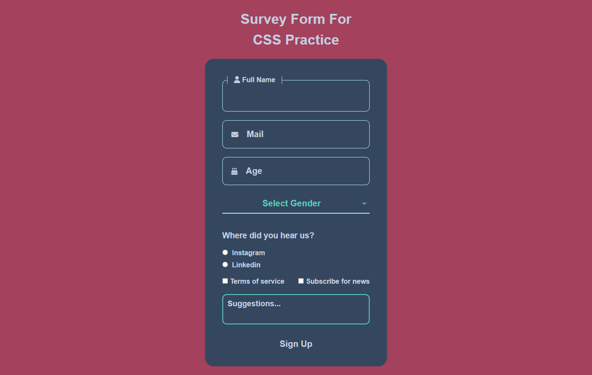

# :fountain_pen: Kayıt Formu Projesi | Survey Form

* Bu proje, Patika Frontend Bootcamp'i için oluşturulan **Hafta-2 / Ödev-Opsiyonel / Kayıt Formu** projesidir.
* **CSS** ve **HTML:Form** alıştırması için bir pratik projesidir.
* **HTML** ve **CSS** kullanılmıştır.
---

## :computer: Kullanım

1.  Hafta-2 Projelerimin olduğu toplu repomu klonlayın.
*   git clone https://github.com/tunahanyasar/Hafta-2.git
2. Odev-Opsiyonel dosyasını çalıştırın.

---

## 📜 Sayfa Yapısı

:open_file_folder: **Klasörler;**
* *index.html*
* *style.css*
* *img-page*

1. ***index.html***: Websitesi açıldığında Kayıt Formu karşılamaktadır. **one-page website** olarak tasarlanmıştır. 
    1. Kayıt formunda **h1**, **form**, **fieldset**,**input:text | number | email**, **dropdown**, **radio**, **checkbox**, **textarea** ve **button** bulunur.
3.  ***style.css:*** index.html için yazılan CSS özellikleri bu dosyada derlenmiştir. 
4. ***img-page:*** projenin sayfa çıktısının bulunduğu klasör.

---
## :star2: Özellikler

1. ***Form Input***
    1. CSS ile border ve outline özellikleri kaldırıldı.
    2. "Input"lara fieldset ile çerçeve verildi.
    3. Font-icon ile "input"ların soluna icon eklendi.
    4. "Placeholder"lara CSS özellikleri verildi.

1. ***Full Name:*** 
    1. Kullanıcı ismini yazdığında CSS'in **text-transform:capitalize** özelliği ile her kelimenin başı büyük yazılır. 
    2. **required:** Bu alan gereklidir.
    3. **autofocus:** Sayfa açıldığında cursor buraya odaklanır.
2. ***Email:***
    1. **type="email":** Girilen metnin email cinsinden olmasını sağlar.
     2. **required:** Bu alan gereklidir.
3. ***Age:***
    1. **type="number:** Girilen metnin sayı cinsinden olmasını sağlar.
    2. **pattern="\d{2}"** | **maxlength="2":** Girilen yaş 2 basamaklı olmalıdır.
    3. **min="18"** | **max="99":** Girilen yaş 18-99 arası olmalıdır.
    4. **required:** Bu alan gereklidir.
4. ***Gender:*** 
    1.  **required:** Bu alan gereklidir.
    2. CSS ile width alanı kısılıp, border ve outline kaldırılarak "option"a sadece seçim iconu görseli verildi.
5. ***Radio:***
    1. Radio "input"lara name özelliğine aynı değer vererek sadece tek seçim yapabilinmesi sağlandı.
6. ***Checkbox:***
    1. **required:** Bu alan gereklidir.
7. ***Textarea:***
    1. CSS resize:none ile yeniden boyutlandırması kaldırıldı.
8. ***Button*** 
    

## 💡 Kullanılan Yapılar | Kazanımlar

**HTML:**
* Form Elements
* Form Elements Attributes

**CSS:**
*  Flexbox
* Flexbox Alignment

---

## :paperclip: Sayfa Çıktıları
### Web Sitesi

